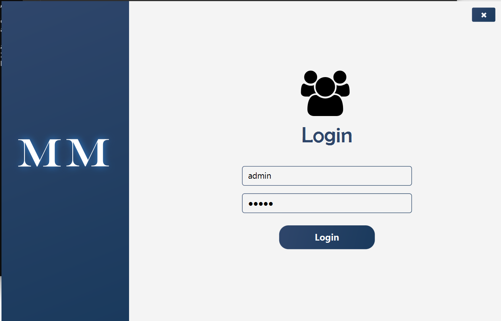
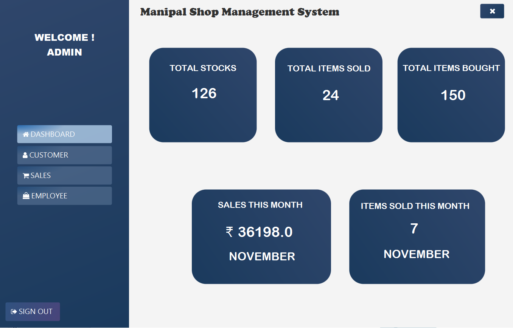
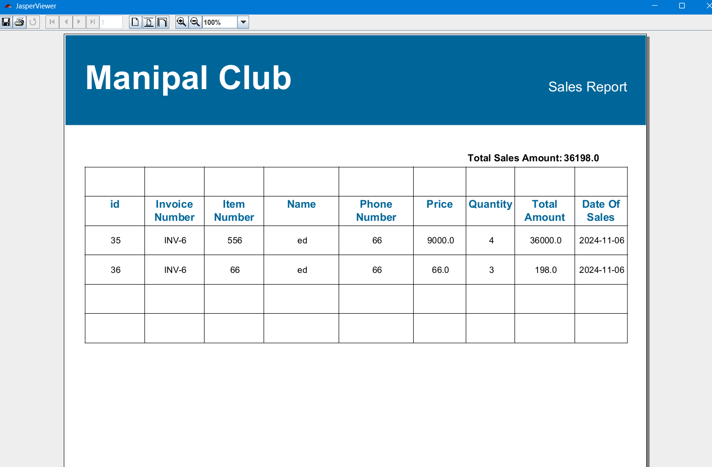
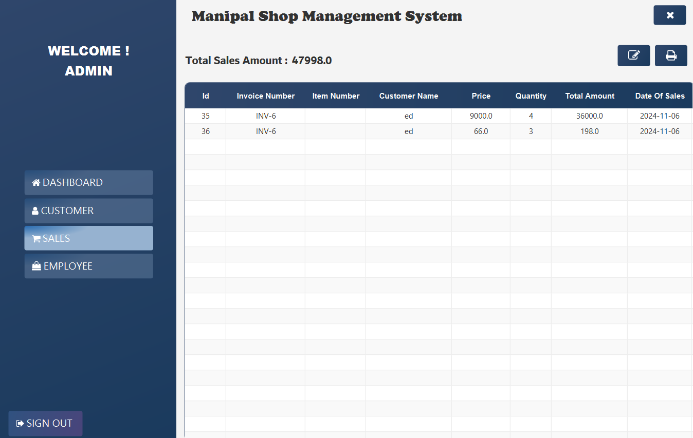
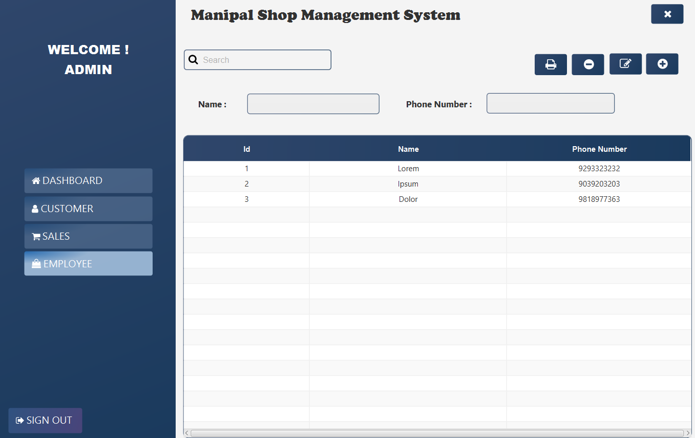

# JavaFX OOPS Project

Repository for source code and documentation of the JavaFX app I created for my Object-Oriented Programming (OOPS) project during my first year of college.

---

## Application Overview

This project is a complete JavaFX-based desktop application showcasing OOP principles, event-driven programming, and a clean user interface.

### Features

- Modular design using classes and inheritance.
- JavaFX GUI with multiple views.
- Object-oriented structure and interaction between components.
- Responsive UI with custom styling.

---

## Screenshots

### Login Handling

### Main Dashboard

### File/Module View

### Functional Interface

### Employee Hadnling

---

##  Technologies Used

- Java
- JavaFX
- FXML
- SceneBuilder
- OOP Design Principles

